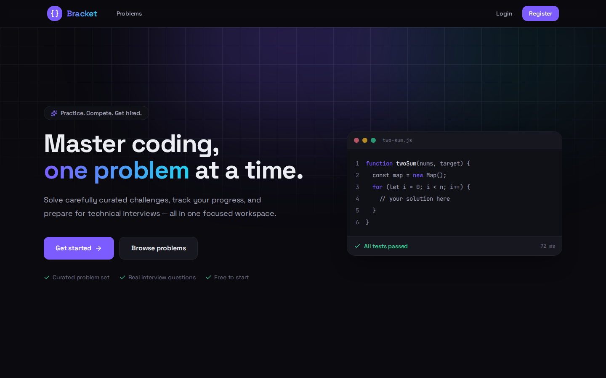
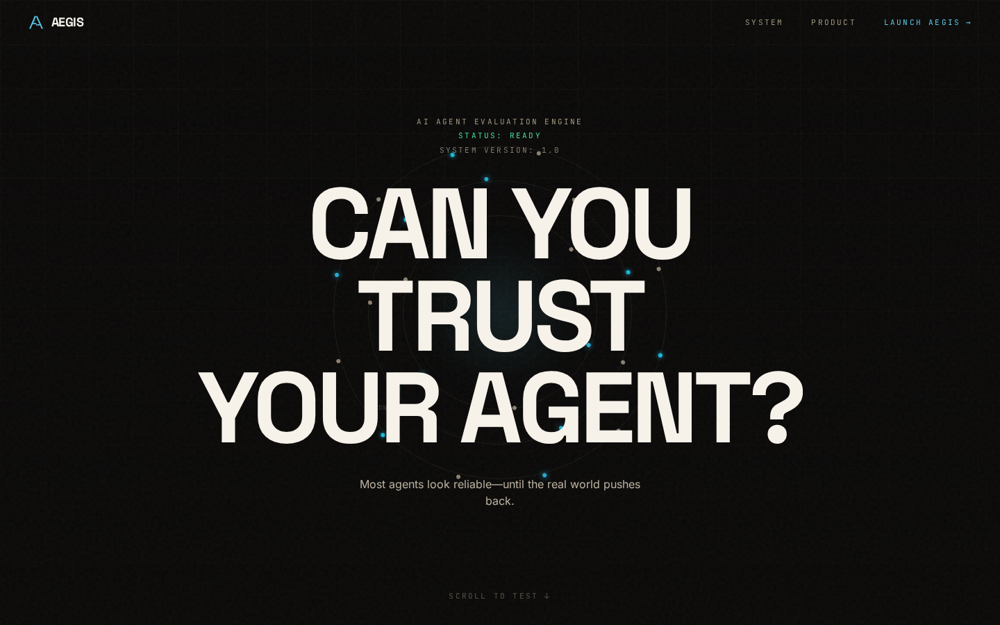
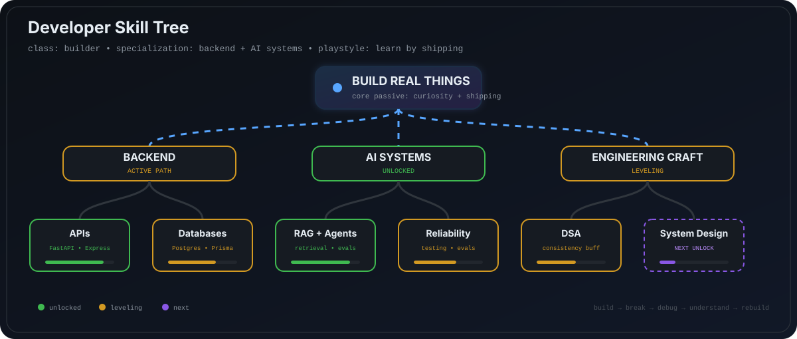

  

 

  

---

## About Me

I'm a student developer based in India who likes building **real, end-to-end software** — backend APIs, automation, AI systems, ML prototypes and polished web interfaces.

- Building with **Python, FastAPI, React and TypeScript**
- Exploring **AI agents, RAG, backend reliability and applied ML**
- Interested in backend engineering, system design and developer tooling
- Usually learning by shipping something instead of just watching tutorials
- When I'm not coding, I'm probably gaming or experimenting with another project

> I like projects where **backend engineering, automation, AI and good product design intersect.**

---

## Tech Stack

---

## Featured Projects

<table>
<tr>
<td width="50%" valign="top">

### 💻 [Brackets](https://github.com/Harsh1t-S/Brackets)

A full-stack **coding-practice platform** with curated problems, an in-browser workspace and progress tracking.

`React` `TypeScript` `Express` `Prisma` `PostgreSQL` `Tailwind`

[Repository](https://github.com/Harsh1t-S/Brackets) · [Live Demo](https://bracketx.vercel.app)

</td>
<td width="50%" valign="top">

### 🛡️ [Aegis](https://github.com/Harsh1t-S/agent-aegis)

**CI for AI agents.** Generates test suites from an agent's system prompt and tool schema, runs them in a sandbox, catches reliability and safety regressions, and turns failures into actionable reports.

`Python` `FastAPI` `React` `AI Agents` `PostgreSQL` `Docker`

[Repository](https://github.com/Harsh1t-S/agent-aegis) · [Live Demo](https://agent-aegis.vercel.app)

</td>
</tr>
<tr>
<td width="50%" valign="top">

### 🔎 [RAG + Query Expansion + Reranker](https://github.com/Harsh1t-S/RAG_with_QueryExpansion_Reranker)

A retrieval pipeline exploring query expansion and reranking to improve the relevance of RAG responses.

`Python` `RAG` `Retrieval` `LLMs`

[Repository](https://github.com/Harsh1t-S/RAG_with_QueryExpansion_Reranker)

</td>
<td width="50%" valign="top">

### 🤖 [LangGraph Multi-Agent System](https://github.com/Harsh1t-S/LangGraph_MultiAgentSys)

Experiments with graph-based multi-agent workflows, orchestration and tool-using AI systems.

`Python` `LangGraph` `Agents` `LLMs`

[Repository](https://github.com/Harsh1t-S/LangGraph_MultiAgentSys)

</td>
</tr>
</table>

---

## Developer Skill Tree

  

---

## Contribution Activity

  <picture>
    <source
      media="(prefers-color-scheme: dark)"
      srcset="https://raw.githubusercontent.com/Harsh1t-S/Harsh1t-S/output/github-snake-dark.svg"
    />
    <source
      media="(prefers-color-scheme: light)"
      srcset="https://raw.githubusercontent.com/Harsh1t-S/Harsh1t-S/output/github-snake.svg"
    />
    
  </picture>

---

## Let's Connect

  I'm always interested in interesting engineering problems, collaborations and building things that are actually useful.

  
  
  
    
  

 

  <i>"Build things. Break things. Understand why they broke. Build them better."</i>

